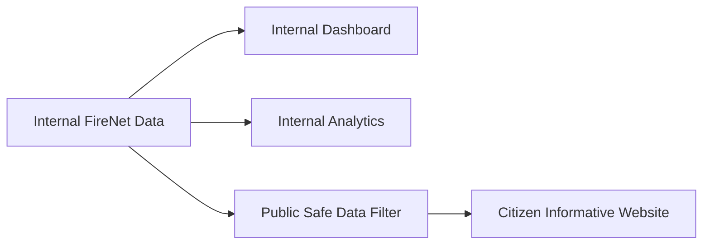

# FireNet Analytics And Public Data Roadmap

## What You Already Have
Your current internal surfaces already expose a strong foundation:
- Internal dashboard: live readiness, active incidents, station health, weekly trends, roster, and briefing widgets in [`NEWFIRENET/pages/dashboard.html`](C:/xampp/htdocs/firenet/NEWFIRENET/pages/dashboard.html)
- Analytics map: incident scope filters, hydrants, heatmap, live route ETA, station AOR circles, and station labels in [`NEWFIRENET/pages/analytics.html`](C:/xampp/htdocs/firenet/NEWFIRENET/pages/analytics.html)
- Backend data already available in [`NEWFIRENET/backend/pages/dashboard.php`](C:/xampp/htdocs/firenet/NEWFIRENET/backend/pages/dashboard.php) and [`NEWFIRENET/backend/pages/analytics.php`](C:/xampp/htdocs/firenet/NEWFIRENET/backend/pages/analytics.php):
  - incident counts and statuses
  - station status / active assignments
  - dispatch station assignments
  - hydrant data
  - station AOR zones
  - geocoded incident locations

## Internal Dashboard Additions
Prioritize widgets that answer: What needs attention right now?
- Response SLA widget:
  - average dispatch time today
  - average arrival ETA / travel estimate
  - incidents breaching target response time
- Alert queue:
  - overdue active incidents
  - offline stations with active coverage gaps
  - hydrants near active incidents marked inactive or maintenance
- Dispatch load balance:
  - incidents handled per station today
  - busiest station now
  - stations with zero availability or heavy load
- Shift summary:
  - incidents this shift
  - resolved this shift
  - most common incident type this shift
- Coverage watch:
  - barangays or zones with no nearby available station
  - AOR overlap / uncovered map view
- Data quality panel:
  - incidents missing coordinates
  - incidents without dispatched station
  - hydrants with missing inspection date

## Analytics Page Additions
Prioritize trend and decision-support views.
- Time-series and comparisons:
  - incident volume by hour / day / week
  - trend comparison vs previous week or previous month
  - station-by-station comparison chart
- Incident classification breakdown:
  - by alarm level
  - by incident status
  - by incident type/category if available in reports
- Response performance analytics:
  - dispatch count per incident
  - average time from report created to first dispatch
  - average time from dispatch to incident closed
  - top delayed incidents
- Geographic analytics:
  - hotspot ranking by barangay
  - incident density inside each station AOR
  - hydrant coverage around hotspot zones
- Resource analytics:
  - hydrants by status, barangay, and inspection age
  - stations by readiness state over time
- Export/reporting features:
  - CSV export for filtered analytics
  - printable incident summary for command briefings

## Best Internal Features To Build First
These give the most value with your current data model.
- `1.` Response performance cards and charts
- `2.` Station workload / dispatch load comparison
- `3.` Hotspot by barangay and AOR coverage summary
- `4.` Hydrant readiness and inspection aging
- `5.` Data quality / missing-map-data warnings

## Public Citizen Website: Safe Real-Time Data To Show
The public site should answer: What is happening, what should citizens know, and how can they stay safe?

Only expose information that is operationally safe and privacy-safe.

### Strong Candidates
- Citywide incident summary:
  - active incidents count
  - incidents resolved today
  - station availability summary as counts only
- Incident map with reduced precision:
  - approximate zone/barangay location, not exact coordinates
  - incident status: active, under control, resolved
  - timestamp of last update
- Public hydrant map:
  - hydrant locations
  - status if appropriate
  - last inspected date if safe to expose
- Station directory:
  - station names
  - contact numbers
  - coverage area / AOR visualization
- Safety advisories:
  - active public notices
  - road / smoke / evacuation advisories if your operations team posts them
- Preparedness content:
  - what to do during a fire
  - emergency hotlines
  - nearest station lookup
- Live counters:
  - incidents today
  - active alerts now
  - average response readiness snapshot

### Good Public Features If You Want More Value
- Barangay risk view:
  - recent incident count by barangay
  - simple low/medium/high activity indicator
- Community updates feed:
  - approved operational announcements only
- Fire safety scorecards:
  - hydrants inspected this month
  - resolved incidents trend
  - public readiness initiatives / drills
- Incident history explorer:
  - filtered by month, barangay, incident type
  - always anonymized and aggregated

## Public Data You Should Avoid Exposing Live
- exact household / building coordinates of incidents
- names, phone numbers, complainant data, or any personal report details
- exact responding unit movement in real time
- full internal station health details if they create security risk
- internal notes, rejection reasons, or operational messaging threads
- exact dispatch sequencing or route ETA if it can be exploited

## Recommended Split: Internal vs Public

## Suggested Public Real-Time Modules
Build the citizen site as a filtered read-only layer from FireNet.
- `live-status`:
  - active incidents count
  - updated timestamp
- `incident-map`:
  - barangay-level incident markers
  - status badges
- `station-directory`:
  - stations, contacts, AOR map
- `hydrant-map`:
  - public hydrants and maintenance status
- `advisories-feed`:
  - approved announcements from internal admin
- `history-insights`:
  - daily/weekly trends and charts

## Best Public Features To Build First
- `1.` Active incidents count + public advisory feed
- `2.` Barangay-based incident map with safe status labels
- `3.` Station directory and AOR map
- `4.` Public hydrant map
- `5.` Historical trend charts by barangay/month

## Practical Next Build Order
- Phase 1:
  - internal response-performance analytics
  - internal station workload widgets
  - public live status summary
- Phase 2:
  - hotspot by barangay and hydrant readiness analytics
  - public advisory feed and public station directory
- Phase 3:
  - public incident map with safe geolocation masking
  - public historical analytics explorer

## Key Files To Extend Later
- internal dashboard UI: [`NEWFIRENET/pages/dashboard.html`](C:/xampp/htdocs/firenet/NEWFIRENET/pages/dashboard.html)
- internal dashboard data: [`NEWFIRENET/backend/pages/dashboard.php`](C:/xampp/htdocs/firenet/NEWFIRENET/backend/pages/dashboard.php)
- analytics UI: [`NEWFIRENET/pages/analytics.html`](C:/xampp/htdocs/firenet/NEWFIRENET/pages/analytics.html)
- analytics data: [`NEWFIRENET/backend/pages/analytics.php`](C:/xampp/htdocs/firenet/NEWFIRENET/backend/pages/analytics.php)
- dispatch/AOR logic reference: [`NEWFIRENET/backend/controllers/reports.php`](C:/xampp/htdocs/firenet/NEWFIRENET/backend/controllers/reports.php)
- schema for AOR and hydrants: [`NEWFIRENET/data/newfirenet.sql`](C:/xampp/htdocs/firenet/NEWFIRENET/data/newfirenet.sql)
